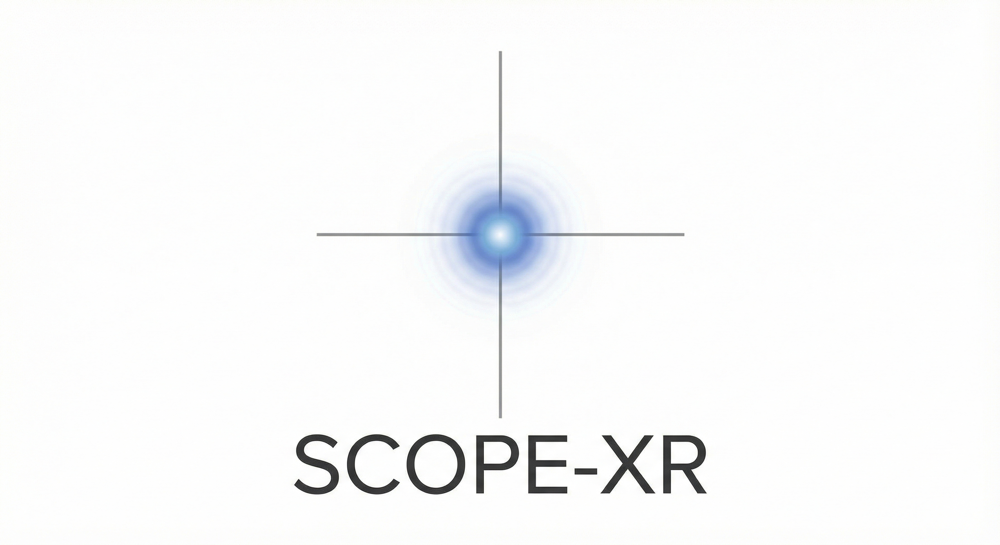
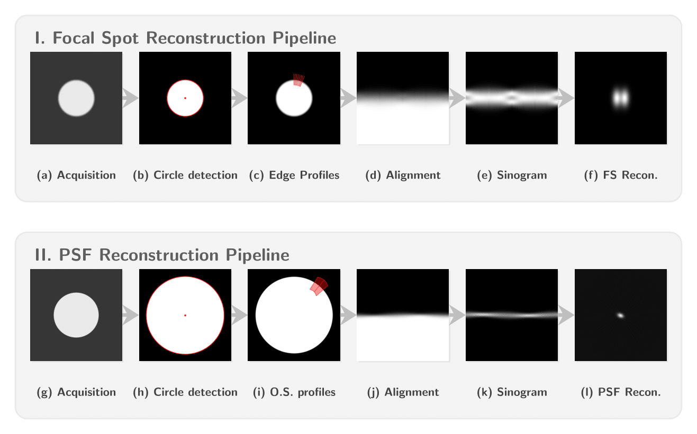

<h1 align="center">

</h1><br>

[](https://www.gnu.org/licenses/gpl-3.0) [](https://www.python.org/downloads/) [](https://scope-xr.readthedocs.io/en/latest/?badge=latest) 

📚 **Full documentation:** [scope-xr.readthedocs.io](https://scope-xr.readthedocs.io/)

- 🚀 [Quickstart Guide](https://scope-xr.readthedocs.io/en/latest/quickstart.html)
- 📖 [User Guide](https://scope-xr.readthedocs.io/en/latest/usage.html)
- 🔧 [Troubleshooting](https://scope-xr.readthedocs.io/en/latest/troubleshooting.html)
- 📝 [API Reference](https://scope-xr.readthedocs.io/en/latest/modules.html)


# Table of Contents

- [Table of Contents](#table-of-contents)
- [Introduction](#introduction)
- [Quick Start](#quick-start)
- [Installation](#installation)
    - [Prerequisites](#prerequisites)
    - [Create and activate a virtual environment (Optional but Recommended):](#create-and-activate-a-virtual-environment-optional-but-recommended)
    - [1. Quick Install (For regular users)](#1-quick-install-for-regular-users)
    - [2. Manual Install (From source)](#2-manual-install-from-source)
- [Usage](#usage)
  - [Supported Image Formats](#supported-image-formats)
  - [GUI Execution](#gui-execution)
  - [CLI Execution](#cli-execution)
    - [Overriding Configuration Parameters](#overriding-configuration-parameters)
- [Processing Pipeline](#processing-pipeline)
- [Documentation](#documentation)
- [Contributing](#contributing)
- [Citation](#citation)
- [Changelog](#changelog)
- [⚖️ License](#️-license)

---

# Introduction

**SCOPE-XR (Single-image Characterization Of PErformance in X-Ray systems)** is a specialized Python framework for the automated characterization of X-ray systems. By analyzing a single acquisition of a circular aperture or disk test object, the software reconstructs 2D source distributions and detector responses.

**Key capabilities:**

- **Focal Spot:** Automated reconstruction of 2D focal spot distribution and dimensions based on the methodology by [Di Domenico et al.](https://aapm.onlinelibrary.wiley.com/doi/abs/10.1118/1.4938414), which is available in the form of an [ImageJ plugin](https://medical-physics.unife.it/downloads/imagej-plugins).
- **PSF:** Automated reconstruction of 2D PSF distribution of the detector, based on the methodology by [Forster et al.](https://www.researchgate.net/publication/387092230_Single-shot_2D_detector_point-spread_function_analysis_employing_a_circular_aperture_and_a_back-projection_approach), with optional sub-pixel oversampling controlled by a single `gaussian_sigma` parameter (0/None = direct binning, >0 = fine-grid blur).

# Quick Start

Get started in 3 steps:

```bash
# 1. Install from PyPI
pip install scopexr

# 2. Run GUI
scopexr-gui

# 3. Or use CLI
scopexr-fs --f "path/to/image.tif"
```

📘 **New to SCOPE-XR?** Check out the [Quickstart Guide](https://scope-xr.readthedocs.io/en/latest/quickstart.html) with step-by-step instructions.

# Installation

SCOPE-XR is installed as a standard Python package. It is recommended to use a virtual environment (venv or conda) to keep your system clean.

### Prerequisites

- Python 3.9 or higher
- Git

### Create and activate a virtual environment (Optional but Recommended):

  **Windows:**

  ```bash
  python -m venv venv
  .\venv\Scripts\activate
  ```

  **Linux/macOS:**

  ```bash
  python3 -m venv venv
  source venv/bin/activate
  ```
### 1. Quick Install (For regular users)

If you just want to use the software without modifying the code, install directly from PyPI:

```bash
pip install scopexr
```

⚠️ **Important**: Configuration files (`.yaml`) are required for execution. Please download them from the `examples` folder and place them in your working directory.  

### 2. Manual Install (From source)

Recommended if you wish to modify the code or contribute:

1. **Clone the repository:**

    ```bash
    git clone https://github.com/jacopoaltieri/scope-xr
    cd scope-xr
    ```

2. **Install the package:**

    Install in editable mode (recommended for development) to ensure all dependencies are handled automatically:

    ```bash
    pip install -e .
    ```

    If you want also to be able to run the tests or build the docs, run:
    ```bash
    pip install -e .[all]
    ```
# Usage

SCOPE-XR provides two main interfaces designed for different user workflows.

The program supports configurable execution via YAML configuration files.
You can find an example of these files in the `examples` folder, along with some simulated images to test the package.


## Supported Image Formats

The supported input image formats are:

- `.png`
- `.tif` / `.tiff`
- `.raw` (must be accompanied by a corresponding `.xml` metadata file)
- `.dcm` (DICOM)

## GUI Execution

The recommended way for routine analysis. It features live image previews and interactive parameter tuning.
To run the GUI, simply type:

```bash
scopexr-gui
```

GUI Features:

- **Easy Mode Selection**: Separate tabs for "Focal Spot (FS)" and "PSF" analysis.
- **Automatic Configuration**: The GUI automatically loads all default parameters from `fs_args.yaml` or `psf_args.yaml` on startup.
- **Image Preview**: Load .png, .tif/.tiff, or .dcm images to see a preview directly in the app.
- **Full Parameter Control**: All CLI flags are editable via interactive widgets.
- **Edit Config Files**: A button allows you to directly open and edit the default .yaml config file for the active tab.
- **Live Output**: All console output from the analysis script is printed directly to a text box within the GUI.
  
## CLI Execution

Ideal for batch processing and integration into automated research pipelines.
To run the program with the default settings (as defined in `fs_args.yaml` or `psf_args.yaml`), use the following commands:

- **Focal Spot:**

  ```bash
  scopexr-fs --f "path/to/img.png"
  ```

- **PSF:**

  ```bash
  scopexr-psf --f "path/to/img.png"
  ```

Use the `--help` flag with any command to see all available parameters.

### Overriding Configuration Parameters

You can override any configuration value directly from the command line by adding the corresponding flag. For example:

```bash
scopexr-fs --f "path/to/img.png" --p 0.2
```

In this case, the pixel size will be set to `0.2 mm` instead of the default value specified in the YAML file.

The full list of CLI flags is available in the [documentation](https://scope-xr.readthedocs.io/)


# Processing Pipeline

<p align="center">
  
</p>

# Documentation

Comprehensive documentation is available at [scope-xr.readthedocs.io](https://scope-xr.readthedocs.io/):

- **[Quickstart Guide](https://scope-xr.readthedocs.io/en/latest/quickstart.html)** - Step-by-step tutorial for first-time users
- **[Installation](https://scope-xr.readthedocs.io/en/latest/installation.html)** - Detailed installation instructions
- **[Usage Guide](https://scope-xr.readthedocs.io/en/latest/usage.html)** - Complete parameter reference
- **[Troubleshooting](https://scope-xr.readthedocs.io/en/latest/troubleshooting.html)** - Common issues and solutions
- **[Theory](https://scope-xr.readthedocs.io/en/latest/theory.html)** - Physical methodology and equations
- **[Pipeline](https://scope-xr.readthedocs.io/en/latest/pipeline.html)** - Processing workflow details
- **[API Reference](https://scope-xr.readthedocs.io/en/latest/modules.html)** - Module and function documentation


# Contributing

We welcome contributions! Whether you're fixing bugs, adding features, improving documentation, or reporting issues, your help is appreciated.

**Quick Start:**

```bash
# Fork and clone
git clone https://github.com/YOUR_USERNAME/scope-xr.git
cd scope-xr

# Install dev dependencies
pip install -e .[dev,test]

# Create feature branch
git checkout -b feature/my-feature

# Make changes, run tests
ruff check
pytest

# Push and create PR
git push origin feature/my-feature
```

📋 **Full guidelines:** See [CONTRIBUTING.md](CONTRIBUTING.md) for detailed instructions on:
- Development setup
- Code style guide (using ruff)
- Testing requirements
- Pull request process
- Reporting bugs and requesting features

# Citation

If you use SCOPE-XR in your research, please cite:

```bibtex
@software{scopexr2026,
  author = {Altieri, Jacopo},
  title = {SCOPE-XR: Single-image Characterization Of PErformance in X-Ray systems},
  year = {2026},
  version = {1.1.5},
  url = {https://github.com/jacopoaltieri/scope-xr}
}
```

**Methodology citations:**
- Focal Spot: [Di Domenico et al. (2016)](https://doi.org/10.1118/1.4938414)
- PSF Analysis: [Forster et al. (2024)](https://doi.org/10.13140/RG.2.2.27408.89607)

**Published paper:**

The SCOPE-XR methodology and software are described in our paper; please cite it as:
Altieri J, Cardarelli P, Di Domenico G, Taibi A. A python framework for single-image characterization of X-ray focal spot distribution and detector point spread function. Med Phys. 2026;53:e70513. https://doi.org/10.1002/mp.70513

```bibtex
@article{https://doi.org/10.1002/mp.70513,
author = {Altieri, Jacopo and Cardarelli, Paolo and Di Domenico, Giovanni and Taibi, Angelo},
title = {A python framework for single-image characterization of X-ray focal spot distribution and detector point spread function},
journal = {Medical Physics},
volume = {53},
number = {6},
pages = {e70513},
keywords = {focal spot, image reconstruction, open-source, point spread function, python software, quality assurance, X-ray imaging},
doi = {https://doi.org/10.1002/mp.70513},
url = {https://aapm.onlinelibrary.wiley.com/doi/abs/10.1002/mp.70513},
eprint = {https://aapm.onlinelibrary.wiley.com/doi/pdf/10.1002/mp.70513},
year = {2026}
}
```


# Changelog

See [CHANGELOG.md](CHANGELOG.md) for version history and release notes.

---

# ⚖️ License

Distributed under the GNU General Public License v3.0 (GPL-3.0). See `LICENSE` for the full text.
